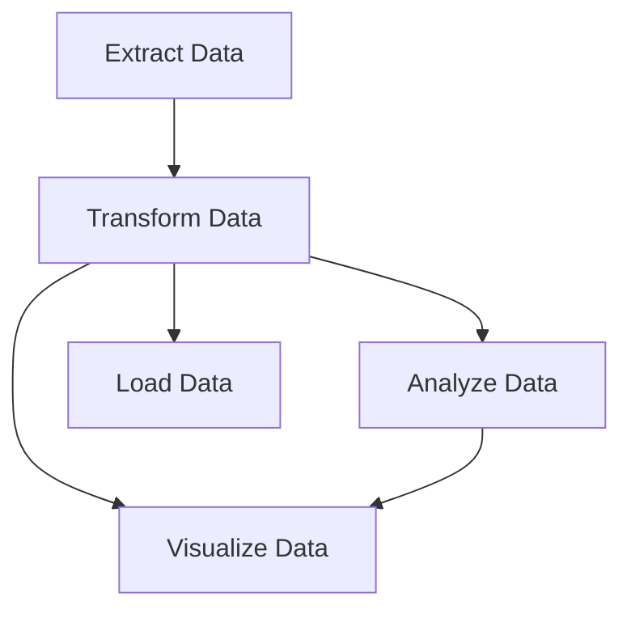

# Supermarket Sales ETL Pipeline solution

## 📦 Required Libraries
```bash
pip install pandas numpy duckdb plotly prefect --quiet
```

## 🚀 Prefect Workflow Implementation

### 1️⃣ Data Extraction (Prefect Task)
```python
import pandas as pd
import numpy as np
import duckdb
import plotly.express as px
from prefect import flow, task
from datetime import datetime

@task(name="Extract Data", retries=2)
def extract_data():
    url = "https://raw.githubusercontent.com/sushantag9/Supermarket-Sales-Data-Analysis/master/supermarket_sales%20-%20Sheet1.csv"
    df = pd.read_csv(url)
    print(f"✅ Extracted {len(df)} records")
    return df
```

### 2️⃣ Data Transformation (Prefect Task)
```python
@task(name="Transform Data")
def transform_data(df):
    # Datetime conversion
    df['Date'] = pd.to_datetime(df['Date'])
    df['Time'] = pd.to_datetime(df['Time'], format='%H:%M').dt.time
    df['DateTime'] = pd.to_datetime(df['Date'].astype(str) + ' ' + df['Time'].astype(str))
    
    # New metrics calculation
    df['Gross Margin Percentage'] = (df['gross income'] / df['Total']) * 100
    df['Hour'] = pd.to_datetime(df['Time'], format='%H:%M:%S').dt.hour
    
    # Data cleaning
    df['City'] = df['City'].str.title()
    df['Product line'] = df['Product line'].str.title()
    
    print("🔄 Data transformation complete")
    return df
```

### 3️⃣ Data Analysis (Prefect Task)
```python
@task(name="Analyze Data")
def analyze_data(df):
    # Product performance analysis
    summary = df.groupby('Product line').agg({
        'Total': 'sum',
        'Quantity': 'mean',
        'Rating': 'mean',
        'gross income': 'sum'
    }).reset_index()
    
    # Time-based sales patterns
    hourly_sales = df.groupby('Hour')['Total'].sum().reset_index()
    
    return summary, hourly_sales
```

### 4️⃣ Data Visualization (Prefect Task)
```python
@task(name="Visualize Data")
def visualize_data(df, summary, hourly_sales):
    # Product performance visualization
    fig1 = px.bar(summary, 
                 x='Product line', 
                 y='Total',
                 title='Total Sales by Product Line',
                 color='Product line')
    
    # Hourly sales pattern visualization
    fig2 = px.line(hourly_sales,
                  x='Hour',
                  y='Total',
                  title='Hourly Sales Pattern')
    
    # Payment method distribution
    fig3 = px.pie(df,
                 names='Payment',
                 title='Payment Method Distribution')
    
    # Save visualizations
    fig1.write_html("product_performance.html")
    fig2.write_html("hourly_sales.html")
    fig3.write_html("payment_distribution.html")
    print("📊 Visualizations saved as HTML files")
```

### 5️⃣ Data Loading (Prefect Task)
```python
@task(name="Load Data")
def load_data(df):
    # Save to analytical database
    conn = duckdb.connect('supermarket_sales.duckdb')
    conn.execute("CREATE OR REPLACE TABLE sales AS SELECT * FROM df")
    
    # Save for big data processing
    df.to_parquet('supermarket_sales.parquet')
    
    # Save processed CSV
    df.to_csv('processed_supermarket_sales.csv', index=False)
    print("💾 Data saved in multiple formats")
```

### 6️⃣ Orchestration Flow (Prefect Flow)
```python
@flow(name="Supermarket Sales ETL")
def supermarket_etl():
    # ETL Pipeline
    raw_data = extract_data()
    clean_data = transform_data(raw_data)
    
    # Analysis Pipeline
    summary_stats, hourly_stats = analyze_data(clean_data)
    visualize_data(clean_data, summary_stats, hourly_stats)
    
    # Data Loading
    load_data(clean_data)
    
    return "🎉 Pipeline execution complete!"
```

### 7️⃣ Pipeline Execution
```python
if __name__ == "__main__":
    # Run Prefect workflow
    result = supermarket_etl()
    print(result)
```

## 🔄 Prefect Workflow Structure


## ✅ Prefect Features Used:
1. **Task Decorators** - `@task` for each processing step
2. **Flow Orchestration** - `@flow` for pipeline management
3. **Automatic Retries** - `retries=2` in extraction task
4. **Task Naming** - Descriptive names for monitoring
5. **Dependency Management** - Implicit through function calls

## 🚀 Execution Instructions
1. Install dependencies:
```bash
pip install pandas numpy duckdb plotly prefect
```
2. Save as `supermarket_etl.py`
3. Run:
```bash
python supermarket_etl.py
```
4. Monitor in Prefect UI (optional):
```bash
prefect server start
```

## 📂 Output Files:
1. `product_performance.html` - Sales by product line
2. `hourly_sales.html` - Sales time patterns
3. `payment_distribution.html` - Payment methods
4. `supermarket_sales.duckdb` - Analytical database
5. `supermarket_sales.parquet` - Columnar storage
6. `processed_supermarket_sales.csv` - Cleaned dataset
```
